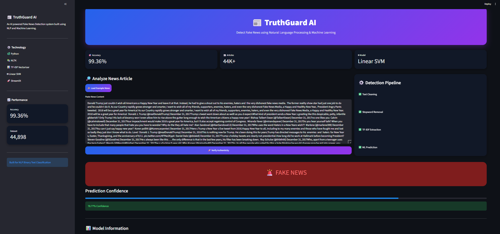

# 📰 TruthGuard AI - Fake News Detection System


## 📌 Overview

**TruthGuard AI** is an end-to-end Machine Learning application designed to classify news articles as **Fake News** or **Real News** using Natural Language Processing (NLP).

The system processes raw news text, extracts meaningful features using **TF-IDF Vectorization**, and predicts authenticity using a trained **Linear Support Vector Machine (SVM)** model.

The project includes complete ML workflow:

- Data preprocessing
- Exploratory Data Analysis
- NLP text cleaning
- Feature extraction
- Model training
- Model evaluation
- Deployment-ready Streamlit application


---

# 🚀 Live Demo

🔗 Streamlit App: Coming Soon


---

# 📸 Application Screenshots


## 🏠 Homepage


## ✅ Real News Prediction


## 🚨 Fake News Prediction




---

# 🧠 Machine Learning Workflow


```

Raw Dataset
      |
      ↓
Text Cleaning
      |
      ↓
Stopword Removal + Stemming
      |
      ↓
TF-IDF Vectorization
      |
      ↓
Linear SVM Model
      |
      ↓
Fake / Real Prediction

```


---

# 📊 Model Performance


| Metric | Value |
|---|---|
| Algorithm | Linear Support Vector Machine |
| Feature Extraction | TF-IDF |
| Dataset Size | 44,898 Articles |
| Accuracy | 99.36% |


---

# 📁 Project Structure


```

Fake-News-Detection/

│
├── app/
│   └── app.py
│
├── data/
│
├── models/
│   ├── fake_news_model.pkl
│   └── tfidf_vectorizer.pkl
│
├── notebooks/
│   ├── 01_data_preparation.ipynb
│   ├── 02_data_exploration.ipynb
│   ├── 03_text_preprocessing.ipynb
│   ├── 04_model_training.ipynb
│   └── 05_model_evaluation.ipynb
│
├── reports/
│
├── screenshots/
│
├── src/
│   ├── preprocessing.py
│   ├── predict.py
│   ├── train_model.py
│   ├── evaluate.py
│   └── utils.py
│
├── requirements.txt
├── LICENSE
└── README.md

```


---

# 🛠️ Technologies Used


## Programming Language
- Python


## Libraries

- Pandas
- NumPy
- Scikit-Learn
- NLTK
- Matplotlib
- Seaborn
- WordCloud
- Joblib


## Deployment

- Streamlit


---

# ⚙️ Installation & Usage


### 1. Clone Repository


```bash
git clone https://github.com/deepakjha018/Fake-News-Detection.git
```


### 2. Navigate Directory


```bash
cd Fake-News-Detection
```


### 3. Install Dependencies


```bash
pip install -r requirements.txt
```


### 4. Run Application


```bash
streamlit run app/app.py
```


---

# 🔍 Features


✔ Fake News Classification  

✔ Real-time Prediction  

✔ Confidence Score  

✔ Interactive Streamlit UI  

✔ Complete NLP Pipeline  

✔ Model Evaluation Reports  

✔ Production Ready Structure  


---

# 📚 Dataset

Dataset used:

**Fake and Real News Dataset**

Containing:

- Fake.csv
- True.csv


Total Records:

**44,898 news articles**


---

# Future Improvements

- Transformer based models (BERT)
- Multilingual fake news detection
- News URL verification
- Real-time fact checking APIs


---

# 👨‍💻 Developer


Developed by:

**Deepak Kumar Jha**

AI & Data Science Student

Passionate about Machine Learning, Artificial Intelligence and Data Science.


---

⭐ If you found this project helpful, consider giving it a star!
